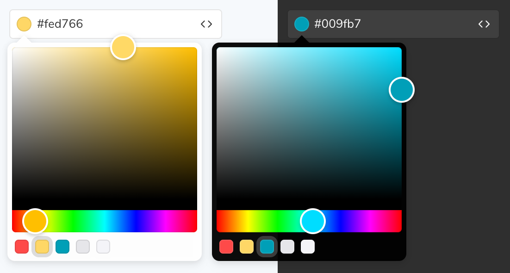

# react-layouts

<div align="center">
  
</div>

<div align="center">
  <a href="https://npmjs.org/package/react-layouts">
    
  </a>
  <a href="https://github.com/hireformation/react-layouts/actions">
    
  </a>
  <a href="https://codecov.io/gh/hireformation/react-layouts">
    
  </a>
  <a href="https://npmjs.org/package/react-layouts">
    
  </a>
  <a href="https://bundlephobia.com/result?p=react-layouts">
    
  </a>
  <a href="https://npmjs.org/package/react-layouts">
    
  </a>
</div>

<div align="center">
  <strong>react-layouts</strong> is a clear, concise, &amp; intuitive collection of layout containers for React designed to make arranging components as easy as drawing.
</div>

## Features

- 🗜 **Small**: Just xxx KB gzipped.
- 🌳 **Tree-shakeable**: Only the parts you use will be imported into your app's bundle.
- 🚀 **Fast**: Built with and functional components only.
- 🛡 **Bulletproof**: Written in strict TypeScript and has 100% test coverage.
- 🗂 **Typed**: Ships with [types included](#typescript-support)
- 😍 **Simple**: The interface is straightforward and easy to use.
- 👫 **Cross-browser**: Works out-of-the-box for most browsers, regardless of version.
- 📲 **Mobile-friendly**: Supports mobile devices and touch screens.

## Table of Contents

- [Getting Started](#getting-started)
<!--
- [Examples](#examples)
- [TypeScript Support](#typescript-support)
- [Browser Support](#browser-support)
- [Why react-layout?](#why-react-layout)
- [Projects using react-layout](#projects-using-react-layout)
  -->

## Getting Started

```
npm install react-layout
```

<!--
## Examples

```js
TODO;
```

[Live demo →](https://codesandbox.io/github/...)

## TypeScript Support

**react-layouts** supports TypeScript and ships with types in the library itself; no need for any other install.

## Browser Support

It would be an easier task to list all of the browsers and versions that **react-colorful** does not support! We regularly test against browser versions going all the way back to 2013 and this includes IE11.

**react-layouts** works out-of-the-box for most browsers, regardless of version, and only requires an `Object.assign` polyfill be provided for full IE11 support.

## Why react-layouts?

Today each dependency drags more dependencies and increases your project’s bundle size uncontrollably. But size is very important for everything that intends to work in a browser.

**react-layouts** is a simple color picker for those who care about their bundle size and client-side performance. It is fast and lightweight because:

- built with functional components only (no classes and polyfills for them);
- ships only a minimal amount of manually optimized color conversion algorithms (while most of the popular pickers import entire color manipulation libraries that increase the bundle size by more than 10 KB and make your app slower).

## Projects using react-colorful

<details>
  <summary><a href="https://storybook.js.org/">Storybook</a> — the most widely used open-source tool for developing UI components</summary>

  <a href="https://storybook.js.org/">
    
  </a>
</details>
-->

Built by [Formation](https://www.hireformation.com) in Boston.

## Acknowledgements

- Boilerplate derived from [react-colorful](https://github.com/omgovich/react-colorful).
- Idea based on Java Swing's Container classes.

## Supporting This Project

- Give us a star!
- Let us know how you are using this project.
- Hire us for a consulting engagement at [hireformation.com](https://www.hireformation.com)
